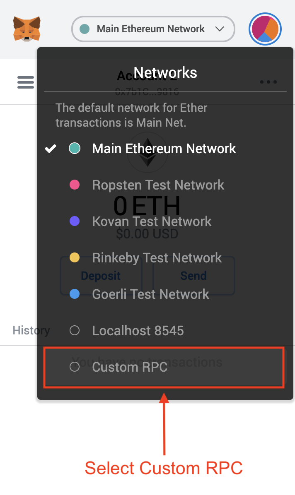
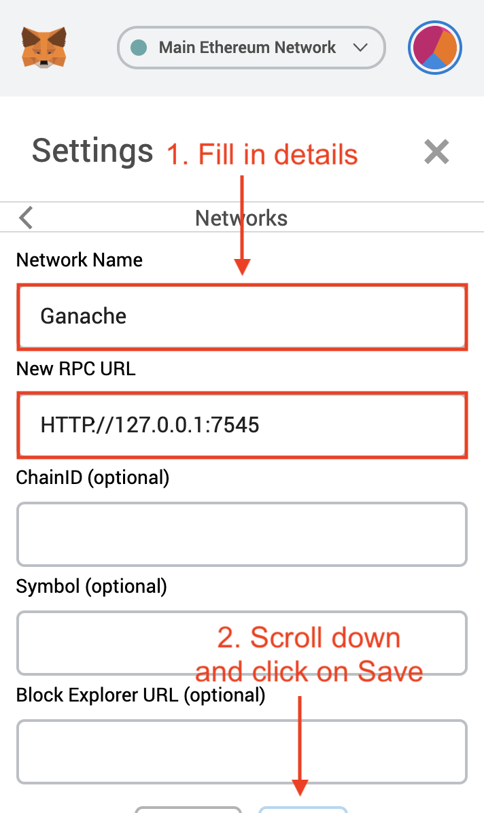
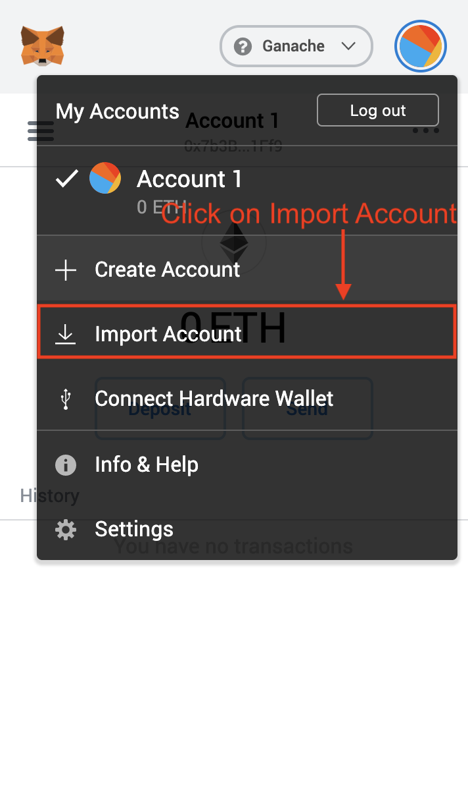
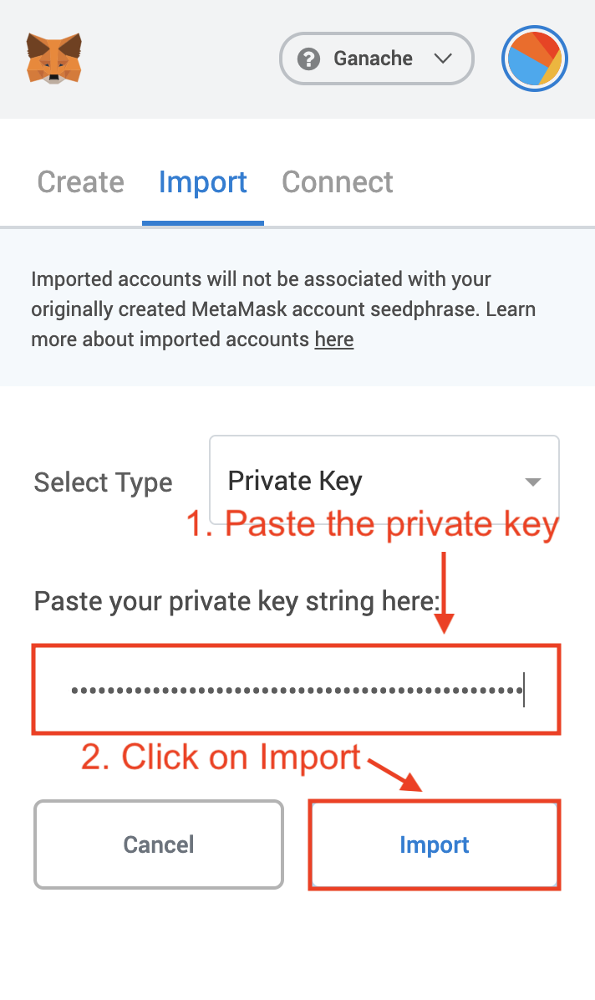
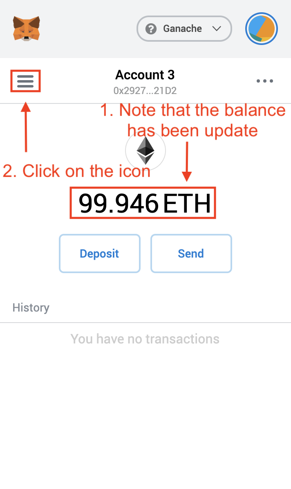
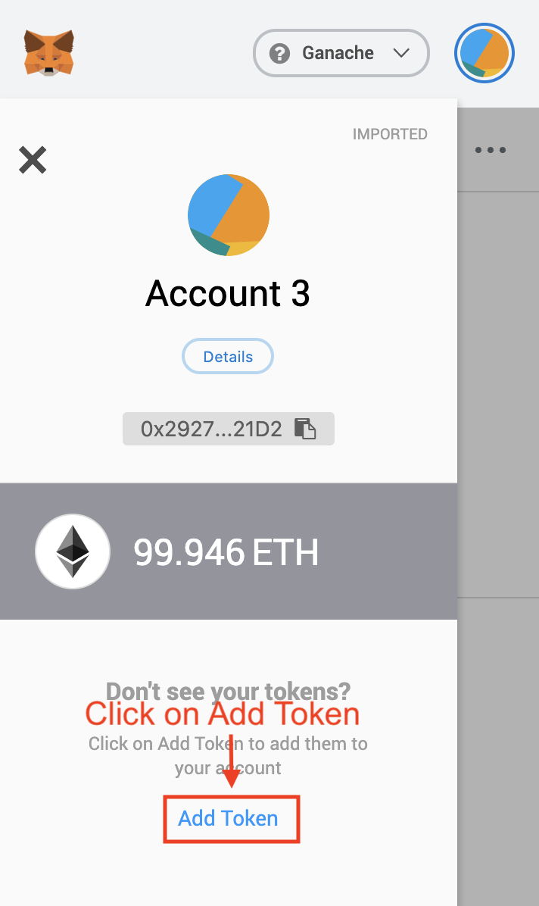
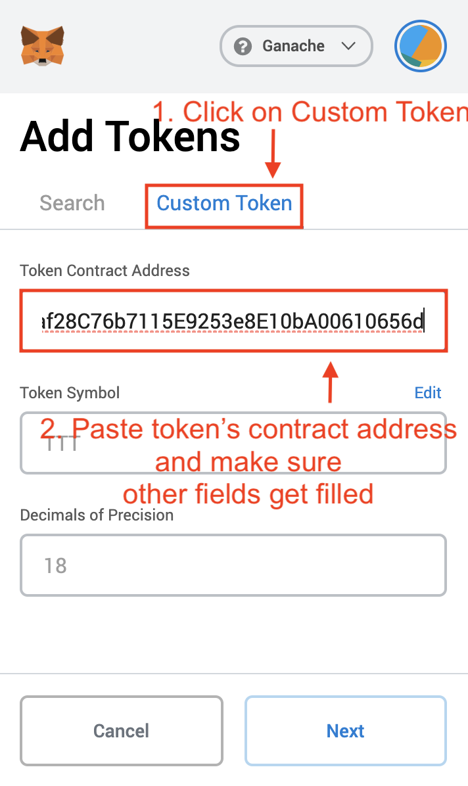
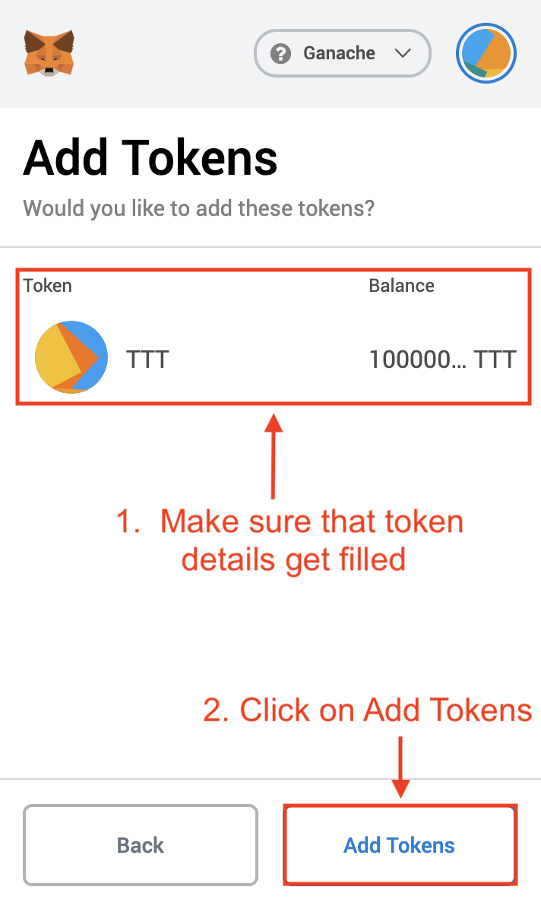

# erc-20-token

A boilerplate project for creating new ERC-20 tokens.

## Usage

1. Install [NPM](https://www.npmjs.com/get-npm)
2. Add [Metamask](https://metamask.io/) extension to your browser
3. Install [Truffle](https://www.trufflesuite.com/):

```bash
npm install -g truffle
```

4. Install [Truffle Ganache](https://www.trufflesuite.com/ganache)

5. Clone GitHub repository:

```bash
git clone https://github.com/vbessonov/erc-20-token
cd erc-20-token
```

6. Install Node dependencies using NPM:

```bash
npm install
```

7. Compile contracts using Truffle:

```bash
➜  erc-20-token git:(master) ✗ truffle compile
```

  <details>
    <summary>
      Show output
    </summary>

```bash
Compiling your contracts...
===========================
> Compiling ./contracts/Migrations.sol
> Compiling ./contracts/TestToken.sol
> Compiling openzeppelin-solidity/contracts/GSN/Context.sol
> Compiling openzeppelin-solidity/contracts/math/SafeMath.sol
> Compiling openzeppelin-solidity/contracts/token/ERC20/ERC20.sol
> Compiling openzeppelin-solidity/contracts/token/ERC20/IERC20.sol
> Compiling openzeppelin-solidity/contracts/utils/Address.sol
> Artifacts written to /Users/vbessonov/Future/erc-20-token/build/contracts
> Compiled successfully using:
  - solc: 0.6.2+commit.bacdbe57.Emscripten.clang
```

  </details>

8.  Start Ganache locally:

    1.  Create a new workspace:
        
    2.  Set up a new workspace:
        
    3.  Adding the project to the workspace:
        
    4.  Save workspace's settings:
        

9.  Run tests using Truffle and make sure they succeed:

```bash
➜  erc-20-token git:(master) ✗ truffle test
```

<details>
  <summary>
    Show output
  </summary>
  ```bash
  Using network 'development'.

# Compiling your contracts...

> Everything is up to date, there is nothing to compile.

    Contract: TestToken
      ✓ should put 100000000 TestToken in the first account (41ms)
      ✓ should have TestToken as its name (63ms)
      ✓ should have TTT as its symbol (38ms)


    3 passing (245ms)

````

10. Deploy the token to Ganache:

```bash
➜  erc-20-token git:(master) ✗ truffle deploy

Compiling your contracts...
===========================
> Everything is up to date, there is nothing to compile.


Starting migrations...
======================
> Network name:    'development'
> Network id:      5777
> Block gas limit: 6721975 (0x6691b7)


1_initial_migration.js
======================

  Deploying 'Migrations'
  ----------------------
  > transaction hash:    0xb6100b0a6c838d4a65cf5d00019c9b69b1492570cd21fc08e143b09744bc781a
  > Blocks: 0            Seconds: 0
  > contract address:    0x6b9436f0223ecd196Ce0308151818e38aED085aF
  > block number:        5
  > block timestamp:     1589052451
  > account:             0x2927AA8034AE9e6c0F24C0345597069d8D9E21D2
  > balance:             99.96969592
  > gas used:            164379 (0x2821b)
  > gas price:           20 gwei
  > value sent:          0 ETH
  > total cost:          0.00328758 ETH


  > Saving migration to chain.
  > Saving artifacts
  -------------------------------------
  > Total cost:          0.00328758 ETH


2_deploy_token.js
=================

  Deploying 'TestToken'
  ---------------------
  > transaction hash:    0x258530a966485cf7ce77c3391a050bc8d8a20dd69b2361a9cf4c0a5414092cc8
  > Blocks: 0            Seconds: 0
  > contract address:    0xF34a0b9af28C76b7115E9253e8E10bA00610656d
  > block number:        7
  > block timestamp:     1589052452
  > account:             0x2927AA8034AE9e6c0F24C0345597069d8D9E21D2
  > balance:             99.94651382
  > gas used:            1116764 (0x110a5c)
  > gas price:           20 gwei
  > value sent:          0 ETH
  > total cost:          0.02233528 ETH


  > Saving migration to chain.
  > Saving artifacts
  -------------------------------------
  > Total cost:          0.02233528 ETH


Summary
=======
> Total deployments:   2
> Final cost:          0.02562286 ETH

````

  </details>

10. Deploy contracts using Truffle:

```bash
➜  erc-20-token git:(master) ✗ truffle deploy
```

<details>
  <summary>
    Show output
  </summary>

```bash

Compiling your contracts...
===========================
> Everything is up to date, there is nothing to compile.


Starting migrations...
======================
> Network name:    'development'
> Network id:      5777
> Block gas limit: 6721975 (0x6691b7)


1_initial_migration.js
======================

 Deploying 'Migrations'
 ----------------------
 > transaction hash:    0xb6100b0a6c838d4a65cf5d00019c9b69b1492570cd21fc08e143b09744bc781a
 > Blocks: 0            Seconds: 0
 > contract address:    0x6b9436f0223ecd196Ce0308151818e38aED085aF
 > block number:        5
 > block timestamp:     1589052451
 > account:             0x2927AA8034AE9e6c0F24C0345597069d8D9E21D2
 > balance:             99.96969592
 > gas used:            164379 (0x2821b)
 > gas price:           20 gwei
 > value sent:          0 ETH
 > total cost:          0.00328758 ETH


 > Saving migration to chain.
 > Saving artifacts
 -------------------------------------
 > Total cost:          0.00328758 ETH


2_deploy_token.js
=================

 Deploying 'TestToken'
 ---------------------
 > transaction hash:    0x258530a966485cf7ce77c3391a050bc8d8a20dd69b2361a9cf4c0a5414092cc8
 > Blocks: 0            Seconds: 0
 > contract address:    0xF34a0b9af28C76b7115E9253e8E10bA00610656d
 > block number:        7
 > block timestamp:     1589052452
 > account:             0x2927AA8034AE9e6c0F24C0345597069d8D9E21D2
 > balance:             99.94651382
 > gas used:            1116764 (0x110a5c)
 > gas price:           20 gwei
 > value sent:          0 ETH
 > total cost:          0.02233528 ETH


 > Saving migration to chain.
 > Saving artifacts
 -------------------------------------
 > Total cost:          0.02233528 ETH


Summary
=======
> Total deployments:   2
> Final cost:          0.02562286 ETH
```

</details>

11. Setup Metamask extension:
    1. Set up a custom network:
       
    2. Fill in network details:
       
    3. Copy deployment account's private key from Ganache:
       
       
    4. Import a new account into Metamask:
       
    5. Fill in account's details:
       
    6. Add token contract:
       
       
    7. Add token contract:
       
    8. Fill in token contract's details in Metamask:
       
    9. Fill in token contract's details in Metamask:
       
    10. Make sure that you became an owner of `100,000,000 TTT`:
        
